# AuraX Dashboard

## Introduction

Welcome to the AuraX Dashboard! This internal tool helps AuraX team members manage clients and their images, including versioning.

## System Overview

The AuraX Dashboard consists of five main pages:

1. Home Page - View all clients
2. Create Client Page - Add new clients
3. Client Detail Page - Manage client information and images
4. Image Detail Page - View detailed image information and versions
5. Studio Page - Edit generated/upscaled images

## Home Page

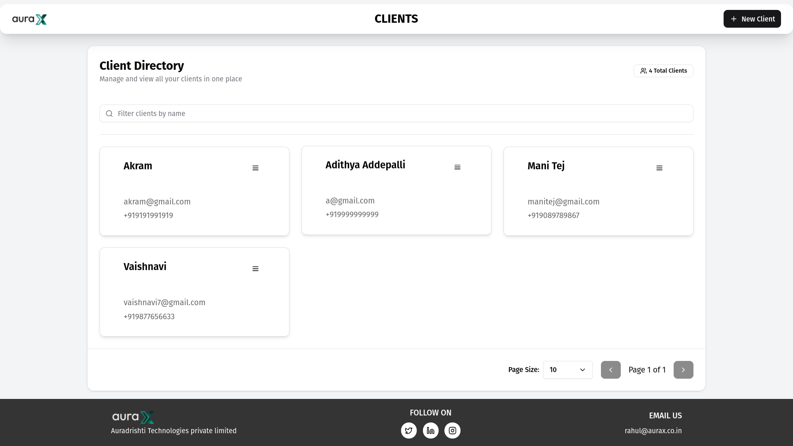

### Viewing All Clients

- The home page displays all clients as clickable card components
- Each card shows basic client information
- Click on any client card to navigate to their detailed page
- Use the search functionality to filter clients by name

### Adding a New Client

- Click the "Create New Client" button on the home page to navigate to the client creation form

## Create Client Page

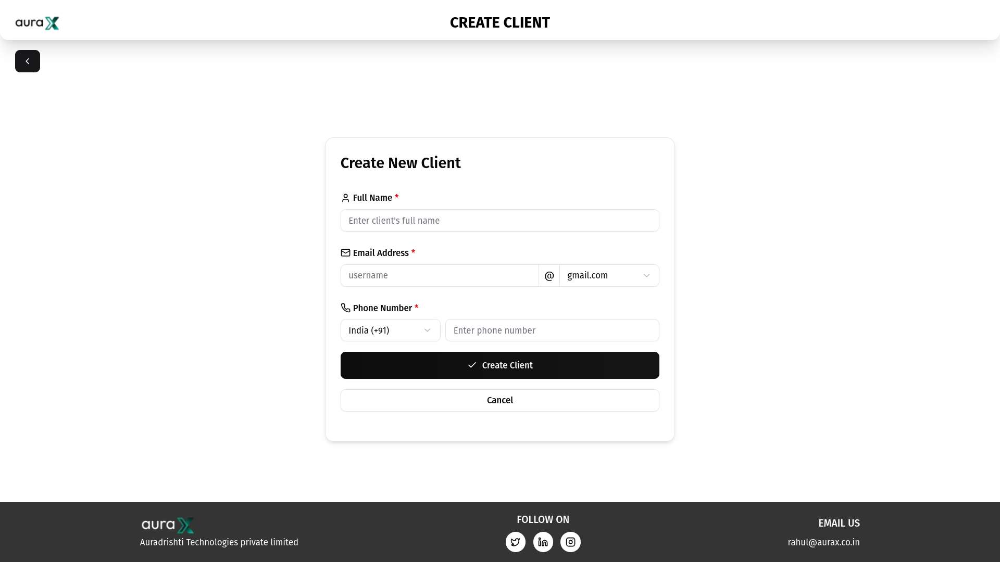

### Creating a New Client

1. Fill in all required fields:
   - Client Name (mandatory)
   - Email Address (mandatory)
   - Phone Number (mandatory)
2. Click "Submit" to create the client
3. After successful submission, you'll be redirected to the home page with the updated client list

### Form Validation

- All fields are mandatory
- The system will display error messages if:
  - Any field is left empty
  - Email format is invalid
  - Phone number is invalid as per the country code
  - Email is already in use by another client

## Client Detail Page


### Viewing Client Information

- The page displays client details including:
  - Client ID
  - Client Name
  - List of paginated images associated with the client in a table format

### Managing Images

The client detail page allows you to:

#### View Images

- Paginated client images are displayed in a table format
- The table shows image metadata and thumbnails
- Use the search functionality to filter images by prompt
- Use AI model filtering to show only images generated by specific models

#### Add New Image

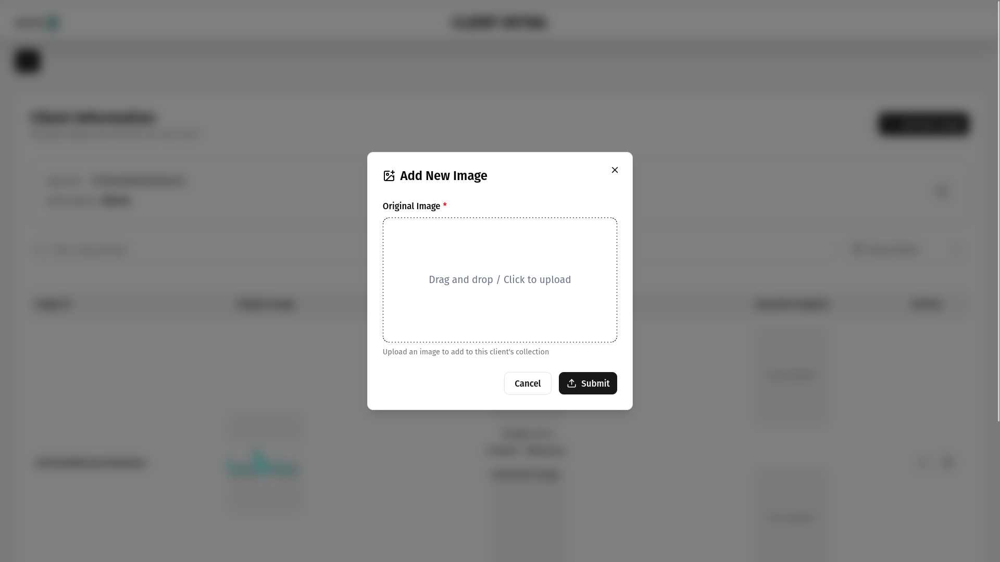

1. Click the "Add New Image" button
2. Upload an image file
3. Click "Submit"
4. The new image will appear in the client's image table

#### Add New Version to Existing Image

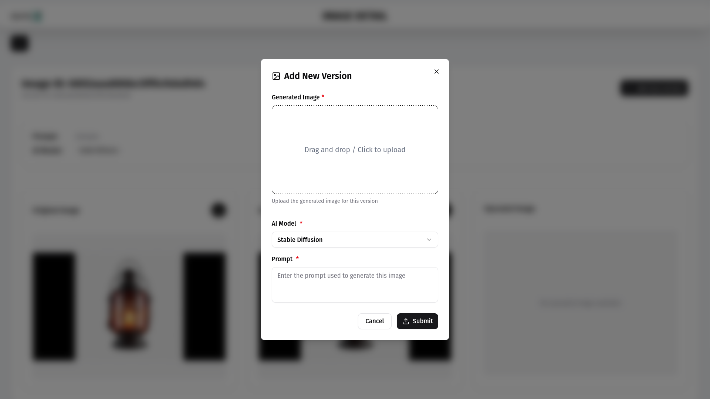

1. Locate the image you want to version in the table
2. Click the "Add New Version" button in that image's row
3. Upload generated image
4. Enter prompt information
5. Select AI model
6. Click "Submit"
7. The client's image table will update to reflect the new version

#### Download all images corresponding to an original image

- There is a button in the last column of every row allowing you to download all the upscaled/enhanced images in that row.

### Navigating to Image Details

- Click on any image in the table to navigate to its detailed view

## Image Detail Page

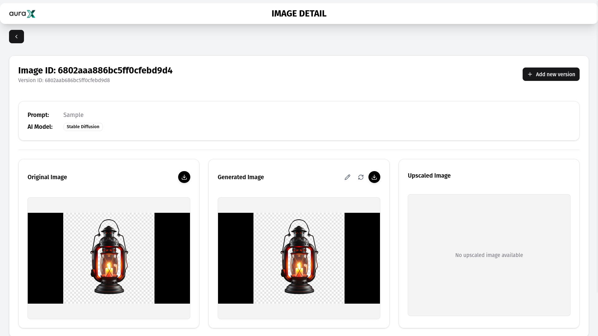

### Viewing Image Details

The image detail page displays:

- Image ID
- Version ID
- Larger previews of:
  - Original image
  - Generated image
  - Upscaled image (if there is one)
- All metadata associated with the image and its versions

#### Edit using built-in studio

- It will allow users to edit the generated image if there is no upscaled image and edit the upscaled image if exists

#### Replace the generated image

- If there is no corresponding upscaled image for a generated image, the system allows you to replace that image with someother image on your local computer

#### Download

- The system will also let you download any of original, generated and upscaled images separately


## Studio Page

The Studio Page provides comprehensive image editing capabilities, allowing users to enhance and modify generated or upscaled images.

### Core Features

#### Basic Adjustments

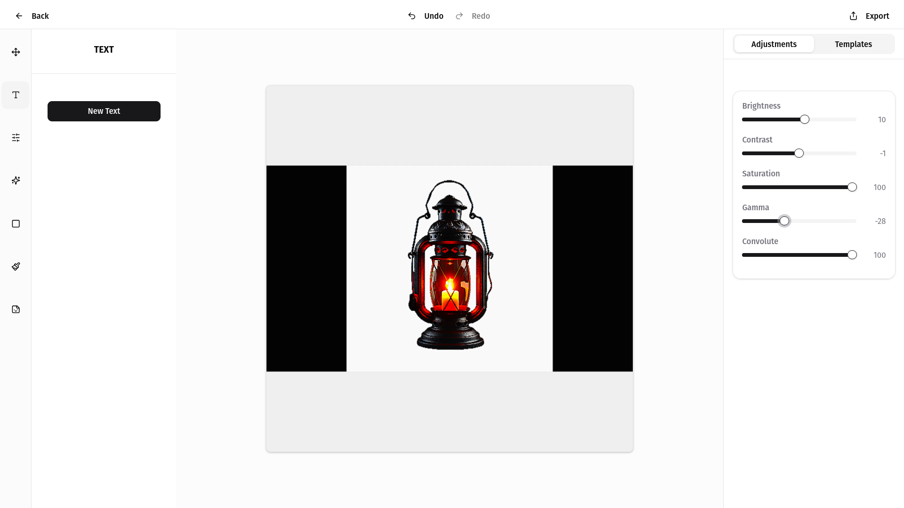

- **Brightness**: Adjust image brightness levels
- **Contrast**: Enhance or reduce image contrast
- **Saturation**: Control color intensity
- **Gamma**: Fine-tune brightness distribution
- **Sharpness**: Adjust image detail clarity

#### Transform Tools

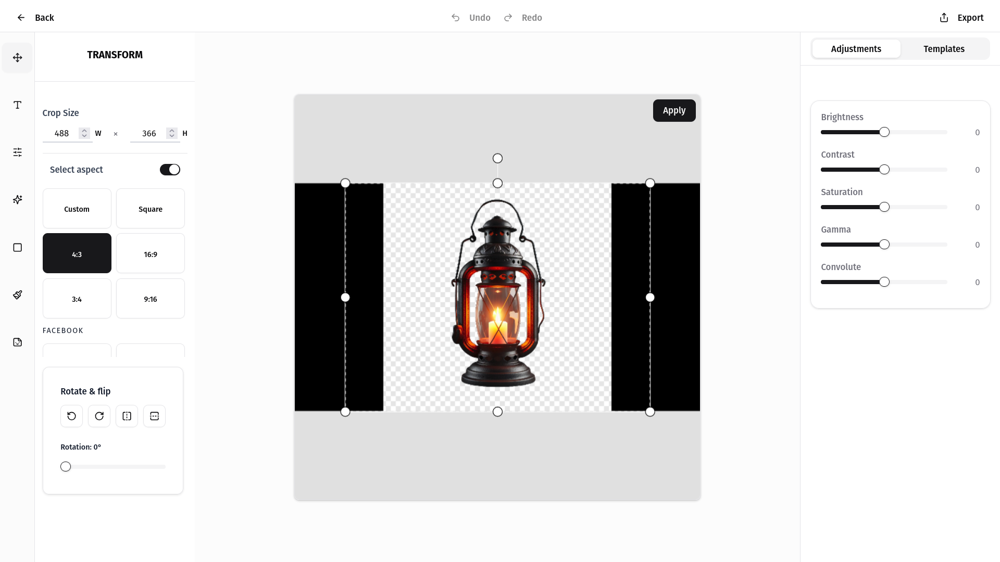

- **Crop**: Resize image dimensions with aspect ratio controls
- **Rotation**: Rotate image in precise increments
- **Flip**: Mirror image horizontally or vertically

#### Text Manipulation

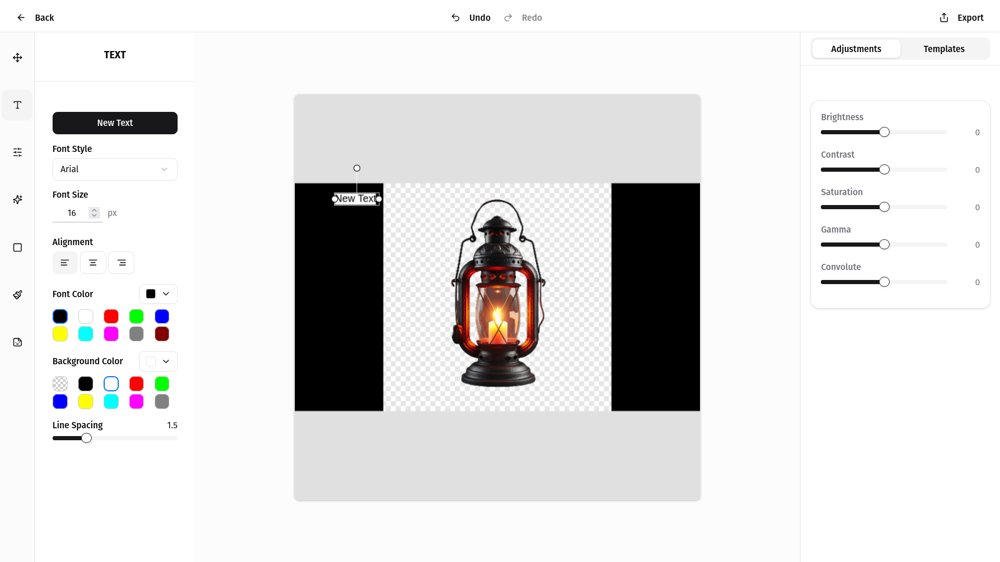

- **Add Text**: Overlay customizable text on images
- **Font Styling**: Change font family, size, color, and opacity
- **Alignment**: Control text positioning and alignment
- **Background**: Add and customize text background colors
- **Advanced Formatting**: Adjust line spacing

#### Filters

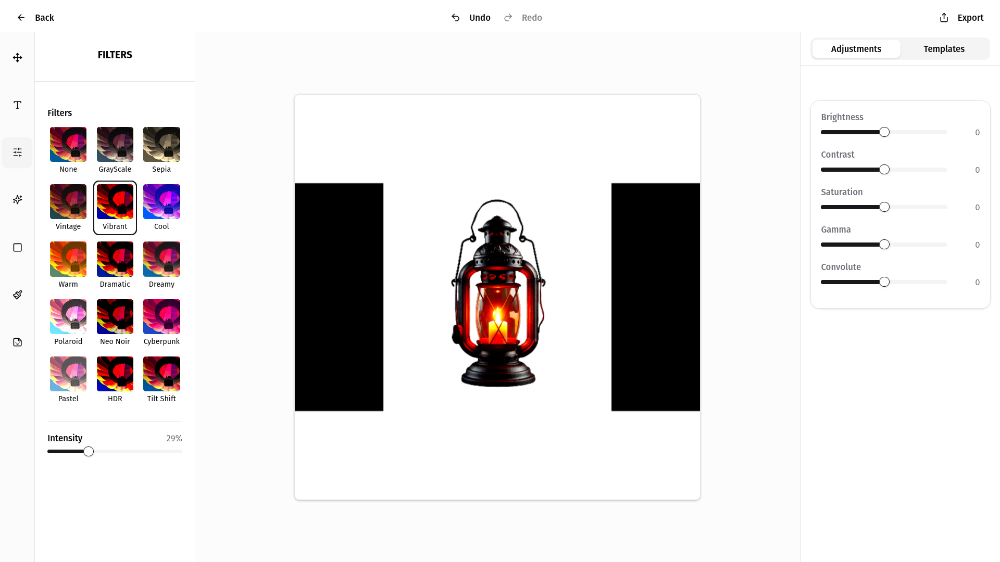

- Apply predefined filters with adjustable intensity
- Examples include vintage, noir, sepia, etc.

#### Effects

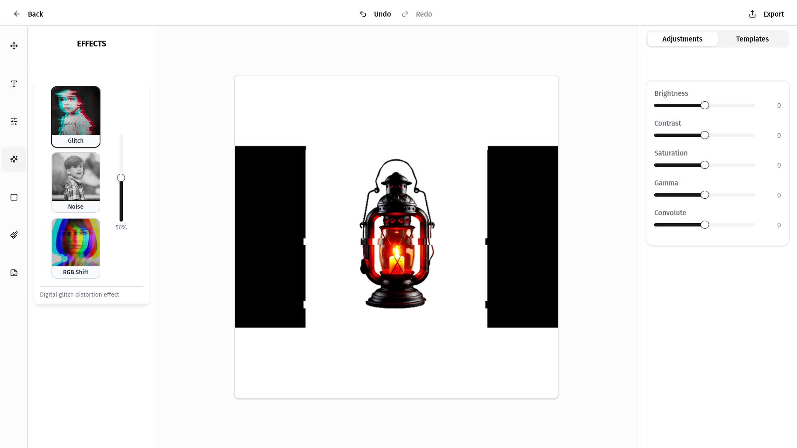

Can apply the following overlays with with adjustable intensity

- **Glitch**: Create digital distortion effects with adjustable intensity
- **Noise**: Add texture with customizable noise patterns
- **RGB Shift**: Create color channel separation effects

#### Overlays

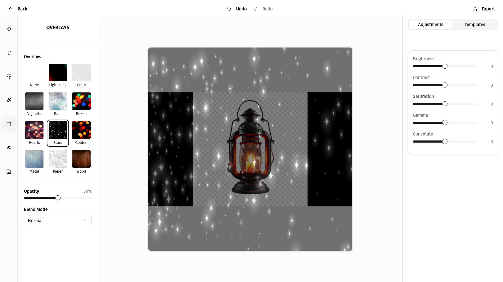

Can apply the following overlays with adjustable opacity and customizable blend mode.

- Apply various overlay patterns and textures
- Control overlay opacity and blend modes
- Choose from a library of pre-designed overlays

#### Brush Tools

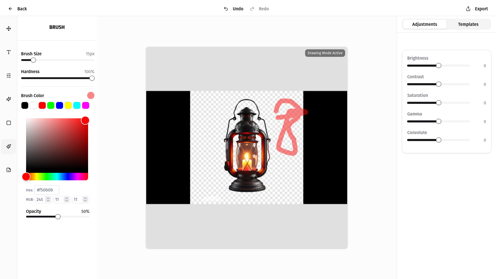

- Draw directly on the image with customizable brushes
- Adjust brush size, hardness, color, and opacity

#### Stickers

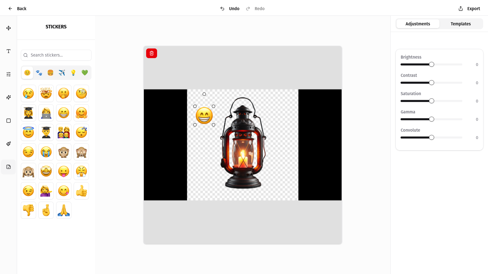

- Add decorative elements and graphics
- Position, rotate, and resize stickers
- Delete unwanted stickers with a single click

### Advanced Features

#### History Management


- Undo/Redo functionality (Ctrl+Z/Ctrl+)
- Comprehensive edit history tracking
- Undo/Redo functionality (Ctrl+Z/Ctrl+Y)

#### Smart Guidelines

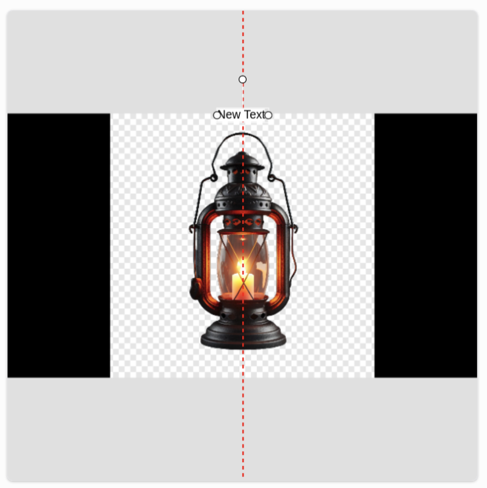

- Alignment guides appear when positioning elements
- Snap to center for precise placement
- Alignment guides appear when positioning elements

#### Export Options

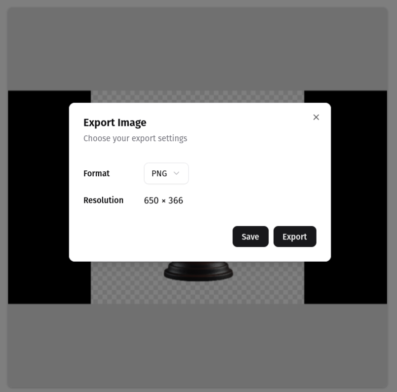

- Download edited images directly to your device in different formats (JPG, PNG)
- Save changes and update the client's image in the database
- Download edited images directly to your device in different formats (JPG, PNG)

### Using the Studio

1. Select an image to edit from the Client Detail Page
2. Choose your desired editing tools from the left panel
3. Make adjustments using the intuitive controlsl Page
4. Preview changes in real-time on the canvas left panel
5. Make adjustments using the intuitive controls
   - Delete/Backspace: Remove selected elements
   - Ctrl+Z: Undo last action efficient editing:
   - Ctrl+Y: Redo last action selected elements
   - Ctrl+D: Duplicate selected text
6. Click "Save" to update the client's image with your changes

The Studio is designed to provide editing capabilities while maintaining an intuitive user experience, allowing AuraX team members to deliver high-quality enhanced images to clients.

## Setup

### Prerequisites

- Install [Next.js](https://nextjs.org/) globally:

  ```bash
  npm install -g next
  ```

- Make sure you have a MongoDB URI. Add it in a `.env` file at the root of `/backend`:

  ```
  MONGODB_URI=your_mongodb_connection_string
  ```

### Steps to Run the Project

1. Clone the repository:

   ```bash
   git clone https://github.com/ManiTej1729/AuraX-Dashboard.git
   cd AuraX-Dashboard
   ```

2. Open **two terminals**:

---

#### Terminal 1: Frontend Setup

```bash
cd auraxdashboard
npm install
npm run dev
```

---

#### Terminal 2: Backend Setup

```bash
cd backend
npm install
npm run dev
```
>>>>>>> a2e2900 (Add project files from zip)
